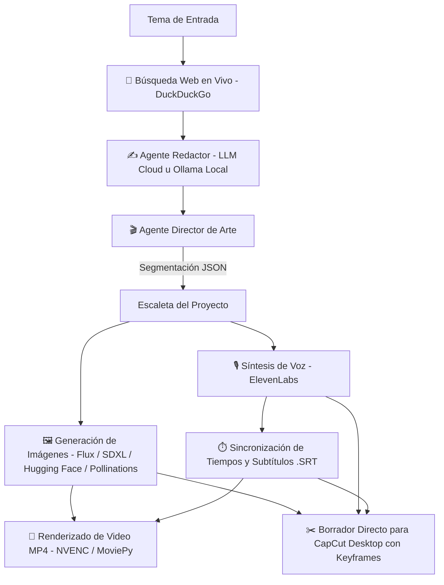

# AI Video Automation Suite 🎬🤖

Una suite completa, modular y profesional impulsada por inteligencia artificial para la generación automatizada de guiones investigados en la red, locución neural, diseño de imágenes de alta fidelidad, exportación de borradores con animaciones a CapCut Desktop y ensamblado de videos cinematográficos para YouTube y redes verticales.

---

## 🏗️ Estructura del Proyecto

El sistema está organizado de forma modular, separando la lógica de agentes, clientes de API, interfaz web, herramientas de consola y exportadores:

```text
ai-video-generator/
├── src/                               # Núcleo del sistema y arquitectura de agentes
│   ├── agents.py                      # Agentes de IA:
│   │                                  #   • ResearcherWriterAgent (Búsqueda web + guion en 2da persona)
│   │                                  #   • PromptDirectorAgent (Segmentación y prompts visuales)
│   │                                  #   • IdeaGeneratorAgent (Lluvia de ideas anti-repetición)
│   │                                  #   • MetadataGeneratorAgent (Títulos SEO, descripción y miniatura)
│   ├── api_clients.py                 # Conectores de API con reintentos y rotación de modelos:
│   │                                  #   • LLMClient (NVIDIA Cloud, OpenRouter, conmutación automática)
│   │                                  #   • LocalOllamaClient (Detección y ejecución local)
│   │                                  #   • ElevenLabsClient (Síntesis de voz neural de alta calidad)
│   │                                  #   • NvidiaImageClient (Flux / SDXL en NVIDIA Cloud)
│   │                                  #   • HuggingFaceImageClient (Inference Providers)
│   │                                  #   • PollinationsImageClient (Fallback gratuito)
│   ├── app.py                         # Backend FastAPI y servidor WebSockets para la Web UI
│   ├── index.html                     # Frontend Web interactivo (Glassmorphism, terminal en vivo)
│   ├── main.py                        # Pipeline principal de renderizado y producción de video (MoviePy/FFmpeg)
│   │
│   ├── cli/                           # Herramientas de consola unificadas (`python -m src.cli`)
│   │   ├── __init__.py
│   │   ├── __main__.py                # Punto de entrada para ejecución modular
│   │   ├── main.py                    # Parser unificado de comandos y argumentos
│   │   ├── compile.py                 # Compilación acelerada por GPU de proyectos existentes
│   │   ├── export_capcut.py           # Generador de borradores nativos para CapCut Desktop
│   │   ├── generate_guides.py         # Generador de guías de edición detalladas escena por escena
│   │   └── import_images.py           # Importación y renombrado cronológico de imágenes externas
│   │
│   ├── exporters/                     # Módulos de exportación a suites de edición externas
│   │   ├── __init__.py
│   │   └── capcut_draft.py            # Generador nativo de borradores CapCut con keyframes de paneo y zoom
│   │
│   └── utils/                         # Utilidades y detección de entorno
│       ├── __init__.py
│       └── capcut_path.py             # Detección inteligente de rutas de CapCut Desktop en unidades C: y D:
│
├── data/                              # Almacenamiento de caché persistente
│   └── generated_scripts_cache.json   # Historial y caché de guiones generados para reanudación
│
├── output/                            # Directorio donde se guardan los proyectos generados (ignorado en git)
│   └── video_[tema]_[timestamp]/      # Carpeta individual por video (imágenes, audios, escaleta.json, .mp4, .srt)
│
├── .env                               # Credenciales de API y configuración privada (ignorado en git)
├── .gitignore                         # Reglas de exclusión de Git
├── history.json                       # Base de datos JSON con el historial de producción de la Web UI
├── ideas_memory.db                    # Base de datos SQLite para memoria y descarte de ideas ya usadas
└── README.md                          # Documentación oficial del proyecto
```

---

## ⚡ Características Principales

* **Búsqueda Web en Vivo**: El Agente Redactor investiga información en tiempo real mediante DuckDuckGo antes de redactar cada guion, extrayendo fechas exactas, transcripciones y hechos verídicos comprobables.
* **Auto-Detección y Soporte Local con Ollama**: Opción en un clic para correr modelos de lenguaje locales (`gemma4`, `llama3.2`, etc.) sin consumir saldo de APIs en la nube.
* **Exportador Nativo a CapCut Desktop**: Inyección directa de proyectos a CapCut (`draft_content.json`), incluyendo pistas de audio sincronizadas, subtítulos y **animaciones automáticas de paneo y zoom** mediante fotogramas clave (*keyframes*).
* **Soporte Multi-Formato Adaptativo**: Generación para formato vertical (**9:16** para YouTube Shorts, Reels y TikTok) y formato horizontal (**16:9** para documentales tradicionales de YouTube).
* **Narrativa Inmersiva ("The Abyss Loop")**: Guiones redactados en segunda persona (*"tú"*) con hooks de retención inmediata y cierre en bucle sin saludos cliché.
* **Filtros de Seguridad Anti-Desmonetización**: Reemplazo inteligente de palabras censurables por metáforas elegantes para evitar restricciones de edad en YouTube.
* **Resiliencia de Conexión y Pool de Respaldo**: Reintentos con *exponential backoff* y rotación automática de modelos ante saturación o límites de tasa.
* **Inspector y Regenerador de Escenas**: Posibilidad de abrir cualquier proyecto terminado en la Web UI, inspeccionar escena por escena, ajustar el texto o el prompt visual y regenerar únicamente dicha imagen o audio.

---

## 🔄 Flujo de Trabajo (Workflow)



---

## ⚙️ Instalación y Requisitos

### Requisitos Previos
1. **Python 3.10 o superior**
2. **FFmpeg** instalado y accesible desde la consola (`ffmpeg -version`)
3. **CapCut Desktop** (opcional, para editar directamente los borradores generados)
4. **Ollama** (opcional, si deseas trabajar de forma local y 100% gratuita)

### Configuración del Entorno
Crea un archivo `.env` en la raíz del proyecto con tus credenciales:

```env
# Claves de IA de Texto (NVIDIA Cloud, OpenRouter u Ollama)
NVIDIA_API_KEY=nvapi-...
NVIDIA_MODEL=meta/llama-3.3-70b-instruct

OPENROUTER_API_KEY=sk-or-v1-...
OPENROUTER_MODEL=meta/llama-3.3-70b-instruct

# ElevenLabs (Voces Neuronales Ultra-Realistas)
ELEVENLABS_API_KEY=sk_...
ELEVENLABS_VOICE_ID=N2lVS1w4EtoT3dr4eOWO

# Generación de Imágenes (NVIDIA Cloud / Hugging Face)
NVIDIA_IMAGE_KEY=nvapi-...
NVIDIA_IMAGE_MODEL=flux.1-schnell

HUGGINGFACE_API_KEY=hf_...
HUGGINGFACE_IMAGE_MODEL=black-forest-labs/FLUX.1-schnell

# Ruta personalizada de borradores de CapCut (Opcional, se auto-detecta)
CAPCUT_DRAFT_PATH=C:/CapCut Projects/com.lveditor.draft
```

---

## 🚀 Guía de Uso

### 1. Interfaz Web Interactiva (Recomendado)
Para iniciar el servidor con consola en vivo, gestión de historial y previsualización de proyectos:

```powershell
python -m src.app
```
Luego abre en tu navegador: **`http://localhost:8000`**

* Desde el menú de **Ajustes ⚙️** puedes presionar **`🦙 Auto-Detectar Ollama`** para cambiar instantáneamente entre la nube y tu motor local.

---

### 2. Comandos CLI Unificados

La suite incluye una interfaz de consola modular accesible mediante `python -m src.cli`:

#### A. Exportar Borrador a CapCut Desktop
Genera un proyecto listo para editar en CapCut Desktop con audio, subtítulos y efectos de movimiento:
```powershell
# Formato Vertical (Shorts, Reels, TikTok - 9:16)
python -m src.cli export-capcut <nombre_carpeta_proyecto> --aspect-ratio 9:16

# Formato Horizontal (YouTube - 16:9)
python -m src.cli export-capcut <nombre_carpeta_proyecto> --aspect-ratio 16:9
```

#### B. Compilar un Video a MP4
Renderiza un proyecto existente utilizando aceleración por hardware (NVENC):
```powershell
python -m src.cli compile [nombre_carpeta_proyecto]
```

#### C. Importar Imágenes Cronológicamente
Si descargaste imágenes generadas manualmente (Midjourney, DALL-E 3, etc.), este comando las renombra y las ubica en el orden temporal exacto de la escaleta:
```powershell
python -m src.cli import-images --origen "C:/Ruta/A/Descargas" --proyecto "video_nombre"
```

#### D. Generar Guía de Edición Escena por Escena
Genera un documento detallado con sugerencias de filtros, efectos sonoros y cortes para el editor humano:
```powershell
python -m src.cli generate-guides [nombre_carpeta_proyecto]
```

---

## 🛡️ Licencia y Uso
Desarrollado para la creación y automatización ágil de contenido audiovisual de alta calidad con IA.
